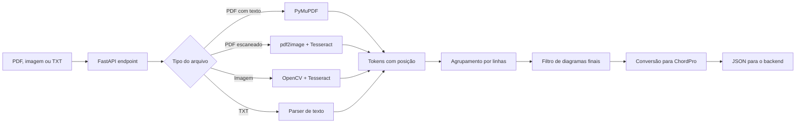

# ChordPro Extractor API


Microserviço Python/FastAPI para transformar cifras em `PDF`, imagem, PDF escaneado ou `TXT` em uma saída limpa no formato **ChordPro**.

Ele foi desenhado para entrar como serviço especializado dentro do ecossistema do Projeto Cifras: o backend principal envia o arquivo por `multipart/form-data`, a API extrai o conteúdo musical, normaliza o layout e devolve um ChordPro pronto para revisão, salvamento e renderização no frontend.

## Visão Geral



## O Que Ele Entrega

| Recurso | Descrição |
| --- | --- |
| Extração de PDF textual | Usa PyMuPDF para ler texto selecionável com coordenadas. |
| OCR para imagem e PDF escaneado | Usa OpenCV/Pillow para preparar imagem e Tesseract para reconhecer texto. |
| Suporte a TXT | Converte cifras textuais preservando alinhamento por espaços. |
| Conversão ChordPro | Insere acordes no ponto aproximado da letra usando posição horizontal. |
| Preservação de tablaturas | Mantém linhas como `E|---`, `B|---`, bateria, baixo e guitarra sem poluir com acordes. |
| Limpeza CifraClub | Remove o bloco final de diagramas/lista de acordes para não sujar o ChordPro. |
| Observabilidade | Logs JSON, `requestId`, metadados e tempo de processamento. |
| Pronto para container | Dockerfile, Docker Compose, health check e CI. |

## Formatos Aceitos

| Extensão | MIME esperado | Estratégia |
| --- | --- | --- |
| `.pdf` | `application/pdf` | Texto selecionável ou OCR se necessário |
| `.png` | `image/png` | OCR |
| `.jpg`, `.jpeg` | `image/jpeg` | OCR |
| `.webp` | `image/webp` | OCR |
| `.txt` | `text/plain` | Parser textual |

## Endpoints

| Método | Rota | Função |
| --- | --- | --- |
| `GET` | `/health` | Verifica se a API está de pé. |
| `GET` | `/health/ready` | Verifica se dependências básicas estão prontas. |
| `POST` | `/api/v1/extractions/chordpro` | Extrai e converte o arquivo para ChordPro. |

Swagger local:

```text
http://localhost:8000/docs
```

## Request

O endpoint de extração **não recebe JSON no corpo**. Ele recebe `multipart/form-data` com um campo chamado `file`.

```http
POST /api/v1/extractions/chordpro
Content-Type: multipart/form-data
```

Campo obrigatório:

```text
file=<PDF, PNG, JPG, JPEG, WEBP ou TXT>
```

Exemplo com `curl`:

```bash
curl -X POST "http://localhost:8000/api/v1/extractions/chordpro" \
  -H "X-Request-ID: teste-local-001" \
  -F "file=@/caminho/para/cifra.pdf"
```

## Response

```json
{
  "requestId": "6e7128dc-6f4c-4eed-8778-3bdf515693ac",
  "status": "NEEDS_REVIEW",
  "sourceType": "OCR_IMAGE",
  "chordPro": "[E]Quando eu digo que deixei de te [B/D#]amar",
  "confidence": 0.72,
  "warnings": [
    "Imagem processada por OCR. Revise o resultado antes de salvar.",
    "A cifra convertida deve ser revisada manualmente."
  ],
  "metadata": {
    "filename": "musica.jpg",
    "mimeType": "image/jpeg",
    "fileSizeBytes": 381204,
    "pagesProcessed": 1,
    "tokenCount": 84,
    "lineCount": 12
  },
  "processingTimeMs": 1320
}
```

## Status Da Extração

| Status | Significado |
| --- | --- |
| `DONE` | Resultado considerado bom para uso direto. |
| `NEEDS_REVIEW` | Resultado útil, mas recomendado revisar antes de salvar. |
| `FAILED` | A API não conseguiu extrair conteúdo suficiente. |

Como regra conservadora, entradas processadas por OCR tendem a retornar `NEEDS_REVIEW`, porque imagem e PDF escaneado podem ter ruído visual, corte, baixa resolução ou fonte ruim.

## Como A Conversão Funciona

O objetivo é transformar uma cifra visual tradicional:

```text
        E                         B/D#
Quando eu digo que deixei de te amar
```

em ChordPro:

```text
[E]Quando eu digo que deixei de te [B/D#]amar
```

Pipeline interno:

1. O arquivo é salvo temporariamente.
2. A API identifica o tipo por MIME/extensão.
3. O extrator gera tokens com texto, posição `x/y`, tamanho e confiança.
4. Os tokens são agrupados em linhas musicais.
5. Linhas de metadados, acordes, letras, seções e tablaturas são classificadas.
6. O bloco final de diagramas de acordes do CifraClub é removido quando detectado.
7. O conversor insere cada acorde no ponto mais provável da letra.
8. A API retorna ChordPro, confiança, warnings e metadados.

## Rodando Com Docker

Copie o arquivo de ambiente se quiser ajustar limites:

```bash
cp .env.example .env
```

Suba a API:

```bash
docker compose up --build
```

Em segundo plano:

```bash
docker compose up -d --build
```

Logs em tempo real:

```bash
docker compose logs -f
```

Parar a API:

```bash
docker compose down
```

Acesse:

| Serviço | URL |
| --- | --- |
| API | `http://localhost:8000` |
| Swagger | `http://localhost:8000/docs` |
| Health | `http://localhost:8000/health` |

## Rodando Localmente

Instale dependências de sistema.

macOS:

```bash
brew install tesseract tesseract-lang poppler
```

Ubuntu/Debian:

```bash
sudo apt-get update
sudo apt-get install -y tesseract-ocr tesseract-ocr-por tesseract-ocr-eng poppler-utils
```

Ambiente Python:

```bash
python -m venv .venv
source .venv/bin/activate
pip install -r requirements-dev.txt
cp .env.example .env
uvicorn app.main:app --reload
```

## Exemplo Com Spring Boot

```java
MultipartBodyBuilder builder = new MultipartBodyBuilder();
builder.part("file", new FileSystemResource(filePath.toFile()));

WebClient client = WebClient.builder()
    .baseUrl("http://score-extractor-api:8000")
    .build();

Mono<ChordProExtractionResponse> response = client.post()
    .uri("/api/v1/extractions/chordpro")
    .header("X-Request-ID", requestId)
    .contentType(MediaType.MULTIPART_FORM_DATA)
    .body(BodyInserters.fromMultipartData(builder.build()))
    .retrieve()
    .bodyToMono(ChordProExtractionResponse.class);
```

## Exemplo No Insomnia

1. Crie uma request `POST`.
2. Use a URL `http://127.0.0.1:8000/api/v1/extractions/chordpro`.
3. Abra a aba `Body`.
4. Escolha `Multipart Form`.
5. Adicione um campo com nome `file`.
6. No tipo do campo, escolha `File`.
7. Selecione um `PDF`, imagem ou `TXT`.
8. Envie a request.

Se o Insomnia bloquear o arquivo por permissão do macOS, habilite a pasta em:

```text
Insomnia Preferences -> General -> Security
```

## Configurações

As principais variáveis estão em `.env.example`:

```text
MAX_UPLOAD_SIZE_MB=20
MAX_PDF_PAGES=10
OCR_DPI=300
OCR_LANGUAGES=por+eng
OCR_TIMEOUT_SECONDS=45
REVIEW_CONFIDENCE_THRESHOLD=0.85
ALLOWED_MIME_TYPES_CSV=application/pdf,image/png,image/jpeg,image/webp,text/plain
ALLOWED_EXTENSIONS_CSV=.pdf,.png,.jpg,.jpeg,.webp,.txt
```

Para produção, ajuste `CORS_ALLOWED_ORIGINS_CSV` para as origens reais do seu frontend/backend em vez de liberar tudo.

## Estrutura Do Projeto

```text
app/
  api/              rotas HTTP e dependências FastAPI
  application/      orquestração do caso de uso
  domain/           modelos, enums e exceções
  infrastructure/   PyMuPDF, OCR, arquivos e conversão ChordPro
  presentation/     schemas de resposta
tests/              testes unitários e de rota
```

## Qualidade E Testes

```bash
pip install -r requirements-dev.txt
ruff check .
pytest
```

Estado atual esperado:

```text
ruff: all checks passed
pytest: 16 passed
```

## Observabilidade

A API emite logs estruturados em JSON com:

| Campo | Uso |
| --- | --- |
| `timestamp` | Momento do evento. |
| `level` | Nível do log. |
| `logger` | Módulo que emitiu o log. |
| `request_id` | Identificador da requisição. |
| `mime_type` | Tipo do arquivo recebido. |
| `token_count` | Quantidade de tokens extraídos. |

Isso facilita acompanhar o processamento via Docker:

```bash
docker compose logs -f chordpro-extractor-api
```

## Limitações Conhecidas

- OCR nunca é 100% determinístico; arquivos escaneados ruins exigem revisão humana.
- PDFs com layout muito visual podem trazer tokens fora de ordem.
- ChordPro gerado deve ser tratado como excelente ponto de partida, não como verdade musical absoluta.
- Diagramas finais do CifraClub são removidos porque não fazem parte da cifra tocável.
- Tablaturas são preservadas, mas não convertidas para outro formato.

## Papel No Projeto Cifras

Este microserviço deve ficar responsável apenas por extrair e normalizar cifra. O backend principal pode salvar o `chordPro`, associar ao usuário/música e entregar para um frontend de leitura, teleprompter, setlist ou editor.

Responsabilidade ideal:

```text
Backend principal -> armazena, autentica e organiza
ChordPro Extractor -> extrai, limpa e converte
Frontend -> renderiza cifra, teleprompter e experiência musical
```
